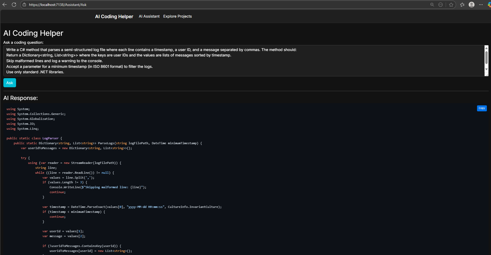
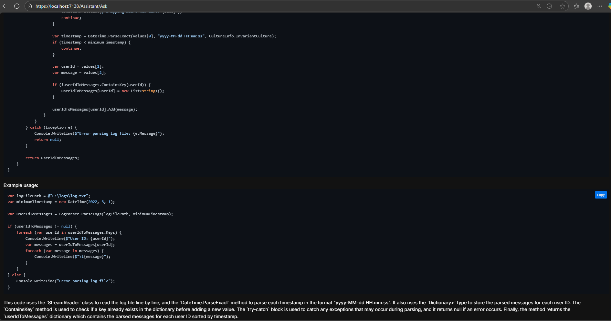

# 🧠 Dev Prompt

A simple, self-hosted AI assistant built using **.NET Core MVC**, integrated with **Ollama** running **Code LLMs** like `code-llama`, and styled with a modern **dark-themed UI**.

This tool helps developers interactively ask coding-related questions and get formatted code snippets as responses — complete with copy buttons and syntax highlighting.

---

## ✨ Features

- ⚡ Chat interface powered by a local LLM using Ollama
- 💬 Real-time Q&A through a web interface
- 🧑‍💻 Code highlighting with `highlight.js`
- 🌙 Dark theme for all pages
- 📋 Copy-to-clipboard buttons for code responses

---

## 📸 Screenshots



---

## 🚀 Getting Started

### 🔧 Prerequisites

- [.NET 8 SDK](https://dotnet.microsoft.com/download)
- [Ollama](https://ollama.com/) installed and running
- Git (for cloning the repo)

### 🔌 Run a model locally with Ollama

```bash
ollama run code-llama
